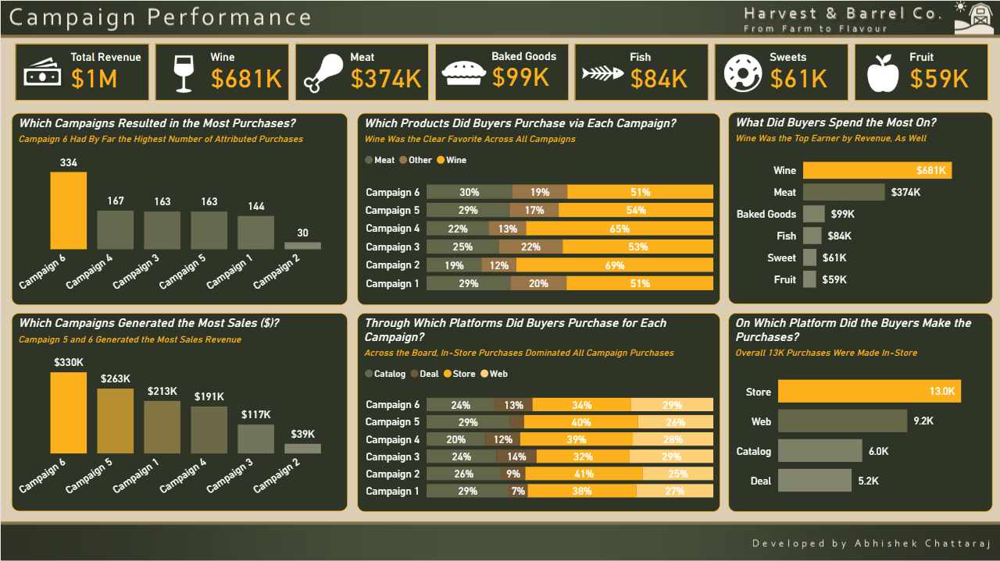
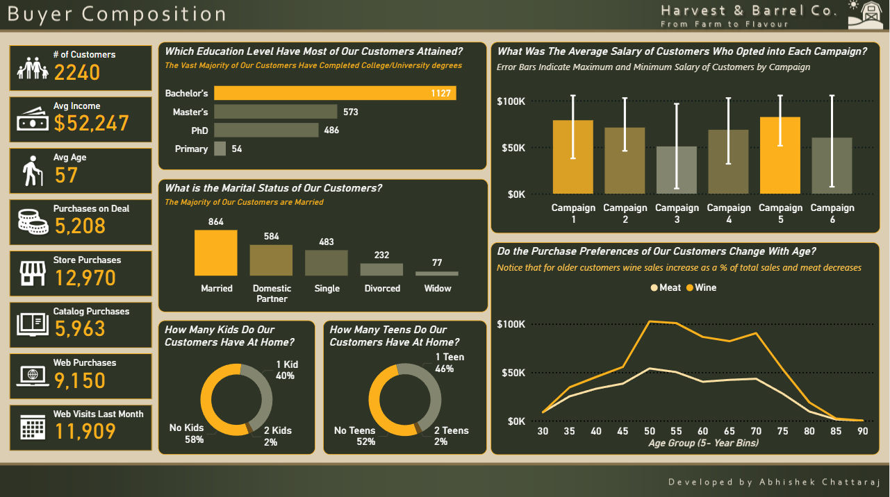
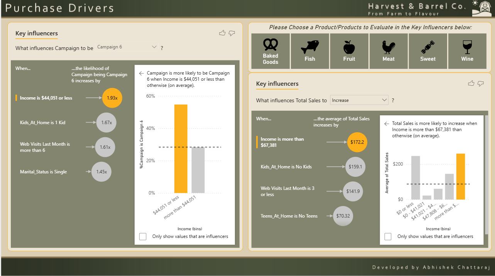

# 🚜 Harvest & Barrel Co. - Marketing Analytics Dashboard

## 📊 Project Overview
**Harvest & Barrel Co.** is a fictional artisanal food and beverage company operating under the "Farm to Flavour" brand. This Power BI project serves as an end-to-end Business Intelligence solution designed to analyze marketing campaign performance, customer demographics, and purchase drivers.

The goal of this dashboard is to move beyond simple reporting and provide actionable **What**, **Who**, and **Why** insights to stakeholders.

## 🔍 Key Business Questions Answered
1.  **Performance:** Which marketing campaigns are driving the highest revenue and volume?
2.  **Demographics:** Who is our ideal customer profile (ICP)? Does spending behavior change with age?
3.  **Predictive Analysis:** What key factors (Income, Family Size, etc.) statistically influence a customer to buy specific products?

---

## 📱 Dashboard Breakdown

### Page 1: Campaign Performance (The "What")

* **Executive KPIs:** High-level view of Total Revenue ($1M), Top Product Categories (Wine: $681K), and volume metrics.
* **Campaign Analysis:** Comparative analysis of 6 distinct marketing campaigns.
* **Category Insights:** Detailed breakdown showing "Wine" as the dominant revenue driver across all campaigns, with a "Meat" secondary grouping.
* **Channel Strategy:** Analysis of purchase platforms (Store vs. Web vs. Catalog), highlighting that in-store purchases account for the majority of volume.

### Page 2: Buyer Composition (The "Who")

* **Demographic Profiling:** Visualizations covering Marital Status, Education Level, and Household Composition (Kids/Teens).
* **Advanced Statistical Charts:**
    * **Salary Distribution:** Used Error Bars to visualize the Min/Max salary range per campaign, offering a deeper view than simple averages.
    * **Trend Analysis:** A custom Line Chart analyzing "Purchase Preference vs. Age," revealing a critical insight: **As customers age, their wallet share shifts significantly from Meat to Wine.**
* **Key Metrics:** Average Customer Age (57) and Average Income ($52,247).

### Page 3: Purchase Drivers (The "Why")

* **AI-Powered Analytics:** Utilized Power BI's **Key Influencers** visual to run regression analysis on the fly.
* **Predictive Insights:**
    * Identified that customers with income **<$44k** are nearly **2x** more likely to engage with Campaign 6.
    * Identified that high-income earners (>$67k) are the primary drivers for total basket size increases.
* **Custom UI:** Designed a custom button-based navigation system to filter AI insights by product category (Baked Goods, Fish, Fruit, Meat, Sweet, Wine).

---

## 🛠️ Technical Implementation
* **Tool:** Microsoft Power BI
* **Languages:** DAX (Data Analysis Expressions) for custom measures and calculated columns.
* **Design:**
    * Custom "Dark Mode" UI theme using the brand palette (Harvest Green & Gold).
    * Use of **Small Multiples** and **Grouped Categories** (Other) to reduce visual clutter.
    * Dynamic Titles using DAX to provide narrative context.
* **Advanced Visuals:** Key Influencers (AI), Error Bars, and Combined Line/Stacked Charts.

## 💡 Key Findings
1.  **Campaign 6 is the clear winner**, driving the highest volume of purchases (334 attributed purchases).
2.  **Wine is the anchor product**, generating 68% of total revenue.
3.  **Age correlates with preference:** There is a distinct crossover point where younger demographics prefer Meat products, while older demographics heavily favor Wine.
4.  **In-Store Dominance:** Despite web presence, physical store purchases remain the primary sales channel (13.0K purchases vs 9.2K web).

## 🚀 How to Use
1.  Download the `.pbix` file from this repository.
2.  Open in **Power BI Desktop**.
3.  Navigate through the pages using the bottom tabs.
4.  On **Page 3**, use the product icon buttons at the top right to dynamically update the AI analysis.

---

**Author:** `Abhishek Chattaraj` — [Email](mailto:abhishekchattarajj@gmail.com) — [LinkedIn](https://www.linkedin.com/in/abhishek-chattaraj-b25a78125) — [GitHub](https://github.com/abhishekchattaraj)
